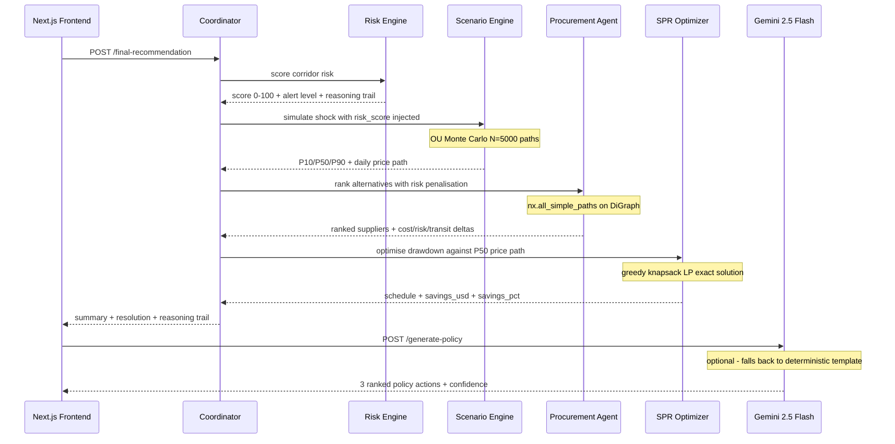
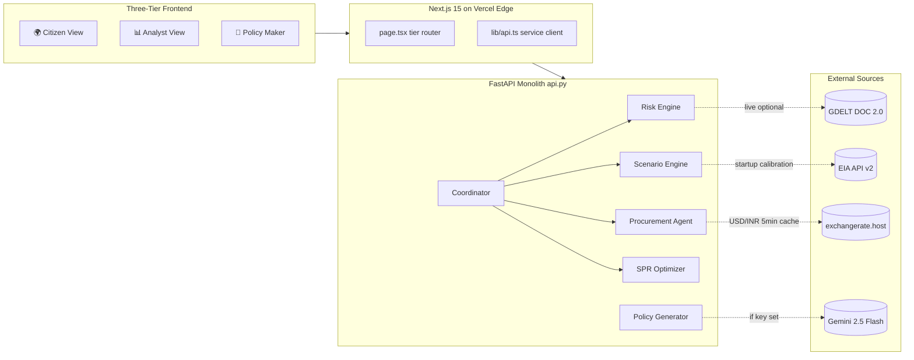
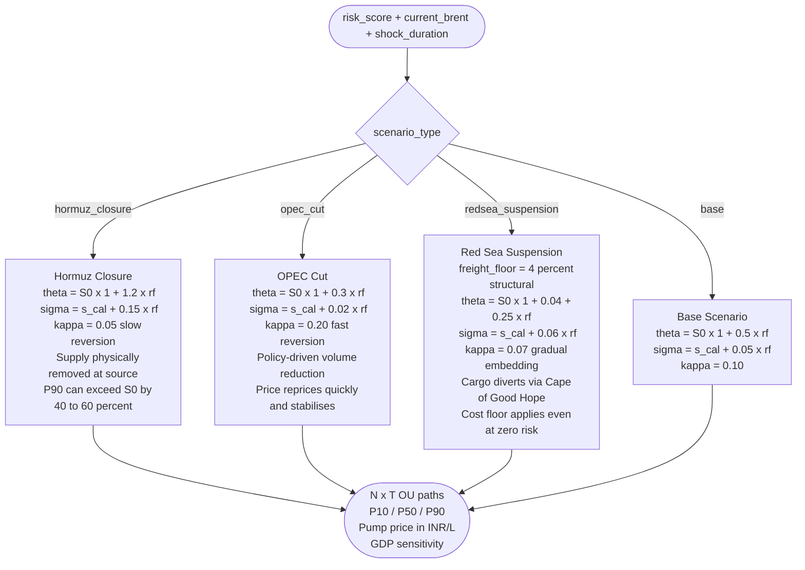

<p align="center">
  
</p>

<p align="center">
  <a href="https://nextjs.org"></a>
  <a href="https://www.typescriptlang.org"></a>
  <a href="https://fastapi.tiangolo.com"></a>
  <a href="https://numpy.org"></a>
  <a href="https://networkx.org"></a>
  <a href="https://vercel.com"></a>
  <a href="#"></a>
  <a href="LICENSE"></a>
</p>

---

## ⚡ The Problem

India imports **88%** of its crude oil. **40–45% of that transits the Strait of Hormuz.** India's SPR covers only **~9.5 days** of consumption vs. the IEA's 90-day benchmark. A single geopolitical event — a tanker seizure, a Red Sea drone strike — translates to a pump-price shock for hundreds of millions of households within days.

**Pravah** converts raw geopolitical signals into ranked procurement alternatives, optimized SPR drawdown schedules, modelled Brent price distributions, and ministerial policy briefs — all in a single API call, all within a 250 MB Vercel serverless function.

---

## 🗺️ How It All Connects



---

## 🏗️ System Architecture



> **Why no scipy / pandas / LangChain?** Vercel's serverless limit is 250 MB. `scipy` alone is ~80 MB; `pandas` ~50 MB. Every heavy dependency was replaced with a hand-rolled equivalent: greedy LP for `scipy.linprog`, NumPy log-returns for calibration, NetworkX `all_simple_paths` for graph traversal. The backend ships under 30 MB of actual Python.

---

## 🧩 The Five Modules

| # | Module | Technique | Output |
|---|--------|-----------|--------|
| 1 | **Risk Engine** | GDELT + fixture events, Goldstein scale, recency decay | Score 0–100, alert level, reasoning trail |
| 2 | **Scenario Engine** | Ornstein-Uhlenbeck GBM, EIA-calibrated σ, N=5000 paths | P10/P50/P90 Brent distribution, pump price impact, GDP delta |
| 3 | **Procurement Agent** | NetworkX DiGraph, `all_simple_paths`, live FX blending | Ranked suppliers with cost/risk/transit deltas |
| 4 | **SPR Optimizer** | Greedy knapsack LP, seasonality factors, price-path input from Scenario | Day-by-day drawdown schedule, savings_usd, replenishment window |
| 5 | **Coordinator** | Sequential agent cascade, algebraic cost-vs-security resolution | One-paragraph summary + five-step reasoning trail |

### Risk Scoring Formula

```
score = corridor_baseline + recency_weighted_event_pressure(capped 40) + goldstein_adjustment

Baselines:  Hormuz=60  |  Red Sea=50  |  Cape=15  |  Domestic=5
Severity:   critical=18pts  |  high=10pts  |  medium=5pts  |  low=2pts
Alert:      ≥75 CRITICAL  |  ≥55 HIGH  |  ≥30 ELEVATED  |  else LOW
```

---

## 🌊 Scenario Engine: Three Distinct Shock Mechanics



`rf = risk_score / 100` · `sigma_cal` calibrated from 24 months of EIA Brent log-returns on startup, falls back to 0.02 if EIA is unreachable.

---

## 🚀 Quick Start

> **Live deployment:** [pravah-ai-two.vercel.app](https://pravah-ai-two.vercel.app)

**Backend**
```bash
pip install -r requirements.txt
uvicorn api:app --host 0.0.0.0 --port 8000 --reload
```

**Frontend**
```bash
cd frontend && npm install && npm run dev   # → http://localhost:3000
```

**Environment variables** *(all optional — system runs fully without them)*

| Variable | Purpose |
|---|---|
| `GEMINI_API_KEY` | Enables LLM path in `/generate-policy` |
| `EIA_API_KEY` | Enables live Brent calibration at startup |
| `NEXT_PUBLIC_*_URL` | Per-service URL overrides for local dev |
| `ALLOWED_ORIGINS` | CORS allowlist (default `*`) |

**Local frontend → backend** — create `frontend/.env.local`:
```bash
NEXT_PUBLIC_RISK_URL=http://127.0.0.1:8000
NEXT_PUBLIC_SCENARIO_URL=http://127.0.0.1:8000
NEXT_PUBLIC_PROCUREMENT_URL=http://127.0.0.1:8000
NEXT_PUBLIC_SPR_URL=http://127.0.0.1:8000
NEXT_PUBLIC_COORDINATOR_URL=http://127.0.0.1:8000
```

---

## 🔌 API Reference

<details>
<summary><strong>Click to expand — all 15 endpoints</strong></summary>

| Method | Path | Agent | Description |
|--------|------|-------|-------------|
| `GET` | `/` | app | Service manifest |
| `GET` | `/health` | app | Liveness probe |
| `GET` | `/data-status` | scenario | EIA source status + cache age |
| `POST` | `/simulate` | scenario | Monte Carlo simulation — `SimulateRequest` |
| `GET` | `/simulate/mock` | scenario | Canned response for UI dev |
| `POST` | `/spr-schedule` | spr | Greedy LP release schedule — `SPRScheduleRequest` |
| `GET` | `/spr-schedule/mock` | spr | Canned response for UI dev |
| `POST` | `/recommend` | procurement | Ranked alternatives — `RecommendRequest` |
| `GET` | `/market` | procurement | Live Brent/WTI/Dubai/Oman/NatGas + USD/INR |
| `GET` | `/graph` | procurement | Full NetworkX supply graph |
| `GET` | `/fleet` | procurement | 35 simulated tanker positions with time-drift |
| `POST` | `/risk-score` | risk | Single corridor score. `?live=true` enables GDELT |
| `GET` | `/corridors` | risk | All four corridors: `hormuz` `redsea` `cape` `domestic` |
| `POST` | `/final-recommendation` | coordinator | Full cascade: Risk → Scenario → Procurement → SPR |
| `POST` | `/generate-policy` | policy | Ministerial brief via Gemini or deterministic fallback |

**Pydantic type literals (from `api.py`):**
```python
Corridor       = Literal["hormuz", "redsea", "cape", "domestic"]
scenario_type  = Literal["base", "hormuz_closure", "opec_cut", "redsea_suspension"]
alert_level    = Literal["low", "elevated", "high", "critical"]
crude_grade    = Literal["GRADE_MEDIUM_SOUR", "GRADE_LIGHT_SWEET", "GRADE_HEAVY_SOUR"]
refinery       = Literal["REF_JAMNAGAR", "REF_VADINAR", "REF_MUMBAI",
                          "REF_PARADIP", "REF_MANGALORE", "REF_VIZAG"]
```

</details>

---

## 🖥️ Frontend Pages

| Page | Tier | Key Features |
|------|------|-------------|
| **Command Center** | Analyst | Live KPI cards · Corridor Risk Monitor · GDELT event feed · animated market ticker |
| **Risk Intelligence** | Analyst | Per-corridor signal breakdown · Goldstein scale · line-by-line reasoning trail |
| **Scenario Modeller** | Analyst | 4 presets · P10/P50/P90 fan chart · pump price + GDP charts · PDF export |
| **Procurement** | Analyst | SVG world map · live-rerouted paths · cost/risk/transit delta HUD |
| **Strategic Reserves** | Analyst | OU price-path chart · safety floor line · day-by-day table · CSV export |
| **Policy Maker** | Policy | Authenticated · AI policy brief · PDF + print export |
| **Digital Twin** | Analyst | Live supply graph on `react-simple-maps` · 35 tanker positions · LIVE/FALLBACK badge |
| **Citizen View** | Public | Risk gauge · simplified corridor map · three published reference metrics |

---

## 🏆 Judging Criteria

| Criterion | Pravah's answer |
|---|---|
| **Innovation** | 3 OU mechanics with distinct physics (not slider re-tuning) · greedy LP exact-equivalent to `scipy.linprog` · deterministic LLM fallback reading live data |
| **Business Impact** | Quantified: cost delta ($/bbl) · SPR savings ($USD) · GDP sensitivity (%) · pump price (₹/L) — all from live EIA data |
| **Technical Excellence** | 2,124-line FastAPI monolith · 5 logical agents · 8 suppliers × 10 routes × 6 ports × 6 refineries in one NetworkX graph · EIA history embedded as CSV for cold start |
| **Scalability** | Vercel serverless under 250 MB · same-origin `/api` routing · per-service URL overrides for horizontal scaling |
| **UX** | 3 audience tiers from one backend · every AI number carries a reasoning trail · PDF/CSV export on 4 pages · full graceful degradation |

---

## 🎬 Demo Video

<p align="center">
  <a href="https://www.youtube.com/watch?v=mHEWgeToNRc">
    
  </a>
  <br/>
  <em>▶ Full cascade: Citizen → Command Center → Risk → Scenario → Procurement → SPR → Policy Maker</em>
</p>

Shot-list and recording script: [`docs/videographer_recording_guide.txt`](docs/videographer_recording_guide.txt)

---

## 🤝 Contributing

Pull requests welcome for:
- Additional corridors (Malacca, Bosphorus, Panama Canal)
- Grade compatibility matrix extensions
- Alternative FX / market data sources

**License:** MIT · see [`LICENSE`](LICENSE)

---


