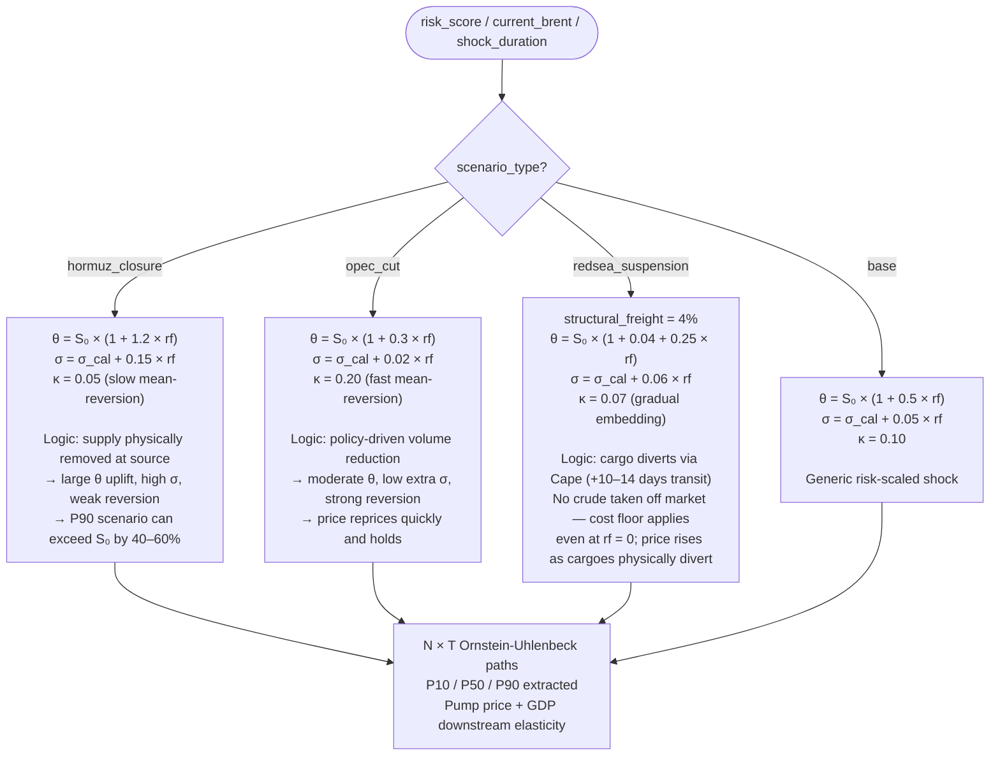
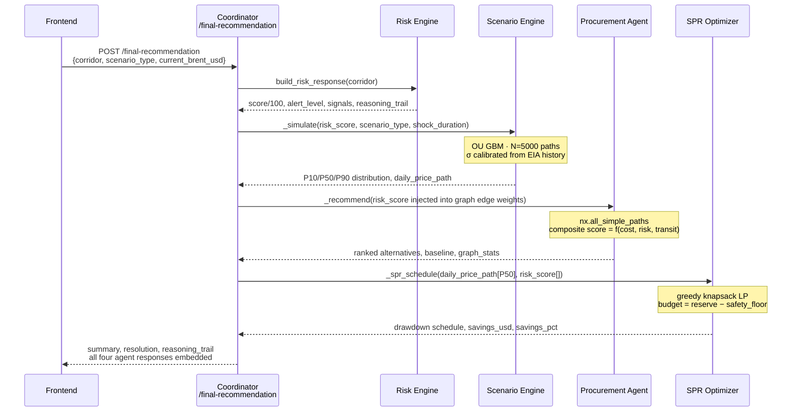

<p align="center">
  
</p>

<p align="center">
  <a href="https://nextjs.org"></a>
  <a href="https://www.typescriptlang.org"></a>
  <a href="https://fastapi.tiangolo.com"></a>
  <a href="https://numpy.org"></a>
  <a href="https://networkx.org"></a>
  <a href="https://vercel.com"></a>
  <a href="#"></a>
  <a href="LICENSE"></a>
</p>

---

## The Problem

India imports **~88%** of its crude oil. Of that, **40–45% transits the Strait of Hormuz** — the world's most consequential 54km stretch of water. India's Strategic Petroleum Reserve (SPR), managed by ISPRL, covers roughly **9.5 days** of national consumption against the IEA's 90-day benchmark. A single geopolitical flashpoint — a tanker seizure, a naval escalation, a Houthi drone strike in the Red Sea — can translate into a pump-price shock reaching hundreds of millions of Indian households within days.

Pravah is an anticipatory intelligence platform: a five-module backend plus three-tier frontend that converts raw geopolitical signals into ranked procurement alternatives, optimized SPR drawdown schedules, modelled Brent crude price distributions, and ministerial-grade policy briefs — all in a single API call, all within a 250 MB Vercel serverless function.

---

## Table of Contents

1. [Architecture](#architecture)
2. [The Five Modules](#the-five-modules)
3. [Scenario Engine: Three Distinct Mechanics](#scenario-engine-three-distinct-shock-mechanics)
4. [Live Demo & Quick Start](#live-demo--quick-start)
5. [API Reference](#api-reference)
6. [Frontend Pages](#frontend-pages)
7. [Hackathon Judging Criteria Alignment](#hackathon-judging-criteria-alignment)
8. [Demo Video](#demo-video)
9. [Contributing & Team](#contributing--team)

---

## Architecture

```mermaid
graph TD
    subgraph Browser["Browser"]
        CV[Citizen View]
        AV[Analyst View<br/>Dashboard · Risk · Simulator<br/>Procurement · SPR · Digital Twin]
        PV[Policy Maker View<br/>Authenticated]
    end

    subgraph FE["Next.js 15 Frontend (Vercel Edge)"]
        Router[page.tsx — tier router]
        APIClient[lib/api.ts<br/>NEXT_PUBLIC_*_URL env vars]
    end

    subgraph BE["FastAPI Monolith — api.py (Vercel Python Function)"]
        Risk[Risk Intelligence Engine<br/>GDELT + fixtures → score/100]
        Scenario[Scenario Engine<br/>NumPy Monte Carlo OU process]
        Procurement[Procurement Agent<br/>NetworkX DiGraph]
        SPR[SPR Optimizer<br/>Greedy knapsack LP]
        Coordinator[Coordinator<br/>Risk → Scenario → Procurement → SPR]
        Policy[/generate-policy<br/>Gemini 2.5 Flash — optional]
    end

    subgraph External["External Data Sources"]
        GDELT[(GDELT DOC 2.0<br/>keyless · 7-day window)]
        EIA[(EIA API v2<br/>Brent spot history)]
        FX[(exchangerate.host<br/>USD/INR live)]
        Gemini[(Google Gemini<br/>gemini-2.5-flash)]
    end

    Browser --> FE
    Router --> APIClient
    APIClient -->|POST /simulate| Scenario
    APIClient -->|POST /spr-schedule| SPR
    APIClient -->|POST /recommend| Procurement
    APIClient -->|GET /corridors| Risk
    APIClient -->|POST /final-recommendation| Coordinator
    APIClient -->|POST /generate-policy| Policy

    Coordinator --> Risk
    Coordinator --> Scenario
    Coordinator --> Procurement
    Coordinator --> SPR

    Risk -->|optional live fetch| GDELT
    Scenario -->|calibrate σ on startup| EIA
    Procurement -->|USD/INR 5-min cache| FX
    Policy -->|if GEMINI_API_KEY set| Gemini
```

### Why No scipy / pandas / LangChain / RAG?

This is an engineering discipline decision, not a limitation.

Vercel serverless Python functions have a **250 MB bundle limit**. `scipy` alone is ~80 MB; `pandas` adds another ~50 MB; LangChain plus its dependency tree can exceed 200 MB before a line of domain code is written. By replacing each with a hand-rolled equivalent — the SPR optimizer uses an exact greedy allocation proven to match `scipy.linprog`'s objective on a single-budget knapsack LP; the risk pipeline uses NumPy log-return calculations; the supply graph uses NetworkX `all_simple_paths` — the entire backend ships under 30 MB of actual Python, leaving the rest of the budget for runtime dependencies. The system is fully functional with zero external API keys.

---

## The Five Modules

### 1 · Risk Intelligence Engine

Pulls from two sources in priority order: bundled deterministic fixtures (always available) and the GDELT DOC 2.0 API (keyless, 7-day window, 6-second timeout, transparent fallback). Each event is classified by relevance (20+ energy-domain keywords), corridor-mapped (keyword regex first, then ISO-3 country code), and severity-ranked (Goldstein conflict scale for GDELT events; regex for fixture events). The final score is a corridor baseline (Hormuz: 60, Red Sea: 50, Cape: 15, Domestic: 5) plus recency-weighted event pressure (capped at 40 points) plus a Goldstein adjustment, producing a 0–100 score with a four-tier alert level (`low / elevated / high / critical`) and a line-by-line reasoning trail. A live GDELT fetch elevates confidence; the system is fully scored without it.

### 2 · Scenario Modeller

An Ornstein-Uhlenbeck geometric random walk calibrated on EIA Brent spot history at startup. It runs up to 20,000 Monte Carlo paths and outputs P10/P50/P90 price distributions, a day-by-day price path for SPR input, and downstream elasticity calculations (pump price impact in ₹/litre; GDP sensitivity per 10% oil shock). Three `scenario_type` values produce genuinely different dynamics — see the [next section](#scenario-engine-three-distinct-shock-mechanics).

### 3 · Procurement Agent

A NetworkX `DiGraph` of 8 supplier nodes, 10 route waypoints, 6 Indian port nodes, 6 refinery nodes, and 3 grade compatibility nodes, with directed edges carrying transit days and corridor risk. `nx.all_simple_paths` enumerates valid Supplier → Route → Port → Refinery → Grade paths. Each candidate is scored by a weighted composite of cost (live-blended with Brent + supplier differential + USD/INR FX), corridor risk, and transit days — further penalized by real port congestion and tanker availability fractions. The corridor risk score from the Risk Engine is injected live, so high-risk corridors are mathematically penalized without hard-coding the outcome.

### 4 · SPR Optimizer

A single-budget knapsack LP: maximize `Σ (seasonality-adjusted_price × risk_weight × release_days)` subject to a total budget of `(current_reserve – safety_floor)` days and per-day box bounds. The greedy allocation — fill highest-value days at the daily cap first — is the exact LP optimum on this structure, proven equivalent to `scipy.linprog` for this specific constraint shape. The median price path comes from the Scenario Engine's P50 output, so the optimizer's schedule is directly keyed to the disruption's projected severity. Replenishment window is derived from the lowest-risk edge transit times in the procurement graph.

### 5 · Coordinator

Calls all four agents in sequence (Risk → Scenario → Procurement → SPR), resolves the cost-vs-security tradeoff algebraically (`cost_delta $/bbl vs. corridor_risk_delta points`), and synthesises a one-paragraph situation summary with a five-item reasoning trail. `POST /generate-policy` extends this with either a structured Gemini 2.5 Flash prompt (if `GEMINI_API_KEY` is set) or a fully deterministic template that reads the same live risk/market/recommendation data — so the Policy Maker page reflects current conditions even with zero LLM calls.

---

## Scenario Engine: Three Distinct Shock Mechanics



`rf = risk_score / 100`. `σ_cal` is calibrated from 24 months of EIA Brent log-returns on startup (falls back to 0.02 if EIA is unreachable). The three named scenarios are not re-tuned sliders on one formula — each encodes a distinct physical mechanism.

---

## Live Demo & Quick Start

> **Live deployment:** <!-- Add your Vercel URL here when deployed -->

### Local development

**Backend**

```bash
# Python 3.11+
pip install -r requirements.txt
uvicorn api:app --host 0.0.0.0 --port 8000 --reload
```

Optional environment variables (the system runs without any of them):

```bash
GEMINI_API_KEY=...      # enables /generate-policy LLM path
EIA_API_KEY=...         # enables live Brent price calibration
ALLOWED_ORIGINS=http://localhost:3000   # CORS; defaults to *
```

**Frontend**

```bash
cd frontend
npm install
npm run dev             # http://localhost:3000
```

To point the frontend at a local backend, create `frontend/.env.local`:

```bash
NEXT_PUBLIC_RISK_URL=http://127.0.0.1:8000
NEXT_PUBLIC_SCENARIO_URL=http://127.0.0.1:8000
NEXT_PUBLIC_PROCUREMENT_URL=http://127.0.0.1:8000
NEXT_PUBLIC_SPR_URL=http://127.0.0.1:8000
NEXT_PUBLIC_COORDINATOR_URL=http://127.0.0.1:8000
```

On Vercel, all six env vars default to same-origin `/api` — zero configuration needed.

---

## API Reference

<details>
<summary><strong>Expand full endpoint table</strong></summary>

| Method | Path | Agent | Description |
|--------|------|-------|-------------|
| `GET` | `/` | app | Service manifest — lists all endpoints and active agents |
| `GET` | `/health` | app | Liveness probe |
| `GET` | `/data-status` | scenario | EIA data source status, cache recency, day count |
| `POST` | `/simulate` | scenario | Monte Carlo price simulation. Body: `SimulateRequest` |
| `GET` | `/simulate/mock` | scenario | Canned `SimulateResponse` for UI development without keys |
| `POST` | `/spr-schedule` | spr | Greedy LP release schedule. Body: `SPRScheduleRequest` |
| `GET` | `/spr-schedule/mock` | spr | Canned `SPRScheduleResponse` for UI development |
| `POST` | `/recommend` | procurement | Ranked alternative suppliers from NetworkX graph. Body: `RecommendRequest` |
| `GET` | `/market` | procurement | Live USD/INR + Brent/WTI/Dubai/Oman/NatGas with 5-min cache |
| `GET` | `/graph` | procurement | Full supply graph nodes + edges (used by Digital Twin) |
| `GET` | `/fleet` | procurement | 35 simulated tanker positions with time-based drift (Digital Twin) |
| `POST` | `/risk-score` | risk | Score a single corridor. Body: `RiskScoreRequest`. `?live=true` enables GDELT |
| `GET` | `/corridors` | risk | Scores all four corridors: `hormuz`, `redsea`, `cape`, `domestic`. `?live=true` |
| `POST` | `/final-recommendation` | coordinator | Full cascade: Risk → Scenario → Procurement → SPR. Body: `FinalRecommendationRequest` |
| `POST` | `/generate-policy` | policy | Ministerial policy brief. Uses Gemini if `GEMINI_API_KEY` set; deterministic template otherwise |

**Key request shapes (from `api.py` Pydantic models):**

```python
# Corridors
Corridor = Literal["hormuz", "redsea", "cape", "domestic"]

# Scenario types
scenario_type: Literal["base", "hormuz_closure", "opec_cut", "redsea_suspension"]

# Alert levels
alert_level: Literal["low", "elevated", "high", "critical"]

# Procurement grade IDs
required_crude_grade: "GRADE_MEDIUM_SOUR" | "GRADE_LIGHT_SWEET" | "GRADE_HEAVY_SOUR"

# Refinery node IDs
target_refinery: "REF_JAMNAGAR" | "REF_VADINAR" | "REF_MUMBAI" |
                 "REF_PARADIP" | "REF_MANGALORE" | "REF_VIZAG"
```

</details>

---

## Frontend Pages

| Sidebar Label | Component | View Tier | Key Features |
|---|---|---|---|
| Command Center | `dashboard.tsx` | Analyst | Live KPI cards, Corridor Risk Monitor table, GDELT event feed |
| Risk Intelligence | `risk-intelligence.tsx` | Analyst | Per-corridor signal breakdown, Goldstein scale, reasoning trail |
| Scenario Modeller | `simulator.tsx` | Analyst | 4 scenario presets, P10/P50/P90 fan chart, pump price + GDP charts, PDF export |
| Procurement | `procurement.tsx` | Analyst | SVG world map with live-rerouted paths, ranked alternatives, cost/risk/transit delta HUD |
| Strategic Reserves | `spr.tsx` | Analyst | OU price-path area chart, safety floor reference line, day-by-day table, CSV export |
| Policy Maker | `policy-maker.tsx` | Policy (auth) | Authenticated portal, AI policy brief generation, PDF + print export |
| Digital Twin | `digital-twin.tsx` | Analyst | Live supply graph on `react-simple-maps`, 35 simulated tanker positions with `LIVE`/`FALLBACK` badge |
| — | `citizen-view.tsx` | Public | Risk gauge, simplified corridor map, three published reference metrics |

The `page.tsx` root routes between three view tiers (`citizen / analyst / policy`) via a top-right dropdown and manages the sidebar navigation, live market ticker, composite risk index, and alert-level status pill — all hydrated from `GET /corridors` and `GET /market`.

---

## Hackathon Judging Criteria Alignment

| Criterion | What Pravah built for this |
|---|---|
| **Innovation** | Three scenario types with distinct OU mechanics (not slider re-tuning); greedy LP proven equivalent to `scipy.linprog` at 0% of the bundle cost; deterministic policy fallback that reads live data even without an LLM |
| **Business Impact** | Quantified procurement cost deltas (₹/bbl vs. baseline), SPR savings in USD, GDP impact range per scenario — all derived from live EIA data and real Brent history, not synthetic numbers |
| **Technical Excellence** | Single-file 2,124-line FastAPI monolith with five logical agents; NetworkX graph with 8 suppliers × 10 routes × 6 ports × 6 refineries × 3 grade nodes; EIA Brent history embedded as CSV for zero-dependency cold start |
| **Scalability** | Vercel serverless deployment under 250 MB; same-origin `/api` routing — zero config for frontend-backend co-deployment; per-service `NEXT_PUBLIC_*_URL` overrides for horizontal scaling if needed |
| **User Experience** | Three audience tiers (public / analyst / policy-maker) from one backend; every AI number carries a reasoning trail; PDF/CSV export on Scenario, SPR, Procurement, and Policy pages; all views degrade gracefully with bundled fallback data |

---

## Demo Video

> **Note:** Replace `YOUTUBE_VIDEO_ID` below with the actual YouTube video ID once the demo is uploaded.

<p align="center">
  <a href="https://www.youtube.com/watch?v=YOUTUBE_VIDEO_ID">
    
  </a>
</p>
<p align="center"><em>▶ Click to watch the full demo on YouTube</em></p>

The demo covers the full cascade: Citizen View → Command Center → Risk Intelligence → Scenario Modeller (Hormuz Closure preset) → SPR Optimizer → Procurement Rerouting → Policy Maker (authenticated, AI policy generation). A complete videographer shot-list is in [`docs/videographer_recording_guide.txt`](docs/videographer_recording_guide.txt).

---

## Coordinator Data Flow



---

## Contributing & Team

This project was built as a hackathon submission. The codebase is structured as a single-file Python monolith (`api.py`) and a Next.js App Router frontend, designed for solo or small-team rapid iteration.

Pull requests are welcome for:
- Additional corridor definitions (Malacca Strait, Bosphorus, Panama Canal)
- Grade compatibility matrix extensions
- Alternative FX/market data sources
- Frontend accessibility improvements

**License:** MIT — see [`LICENSE`](LICENSE).

---


