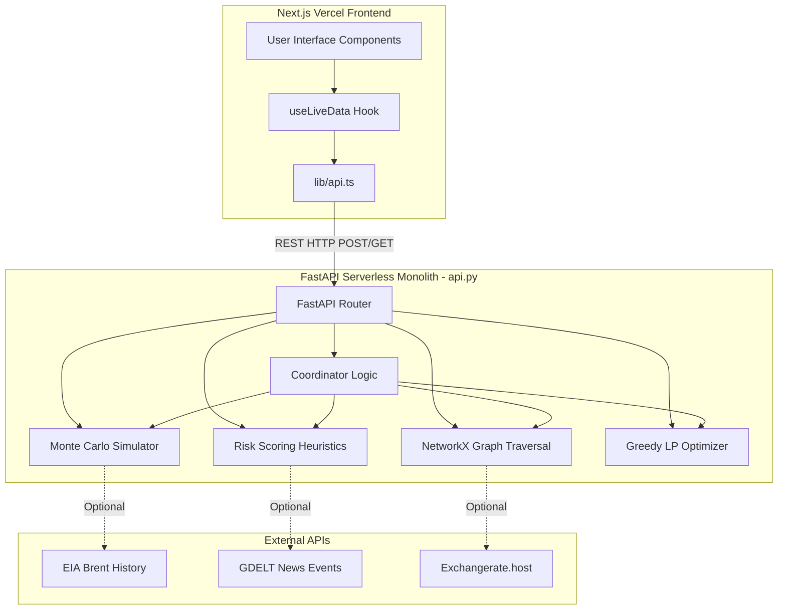

# System Architecture

## Overview
Pravah utilizes a **Serverless Monolith Architecture** for the backend, tightly coupled with a **Next.js App Router** frontend. Originally conceptualized as a distributed multi-agent system, the architecture was intentionally compressed into a monolithic, single-file backend (`api.py`) to conform to serverless deployment constraints (specifically Vercel's 250MB bundle size limit).

## Frontend Architecture
*   **Framework**: Next.js App Router (`app/` directory).
*   **Rendering**: Highly reliant on React Client Components (`"use client"`) due to heavy interactivity, charting, and PDF export functionality.
*   **API Communication**: The frontend maintains the *illusion* of a microservice architecture via its environment variables. `NEXT_PUBLIC_RISK_URL`, `NEXT_PUBLIC_SCENARIO_URL`, etc., are defined independently. In the current deployment, they all route to the same backend monolith, but the codebase supports pointing them to independent services if the infrastructure evolves.
*   **State Management**: Handled via custom React hooks (`useLiveData`) that poll the backend and manage loading/error/fallback states.

## Backend Architecture
*   **Framework**: FastAPI (`api.py`).
*   **State**: 100% Stateless. There is no database (PostgreSQL, Redis, etc.). All inputs required for calculations are passed via POST payloads, and all reference data (e.g., historical Brent prices, supply chain nodes) is hardcoded into the Python script.
*   **Data Models**: Pydantic models are used extensively for request validation and response serialization. These models (e.g., `SimulateRequest`, `RecommendResponse`) serve as the strict data contracts between the Next.js frontend and the FastAPI backend.
*   **Modularity within the Monolith**:
    *   `api.py` is structured sequentially: Data Models -> Embedded Data -> EIA Client -> Scenario Engine -> SPR Optimizer -> Procurement Agent -> Risk Agent -> Coordinator -> FastAPI App initialization.
    *   Each "Agent" is effectively a standalone function (e.g., `_simulate()`, `_spr_schedule()`) that can be called independently via its respective REST endpoint, or composed together by the Coordinator's `_coordinate()` function.

## Architectural Decisions & Constraints
*   **No Heavy Data Science Libraries**: `scipy` and `pandas` were explicitly removed. Algorithms like knapsack optimization for the SPR and Monte Carlo simulations are implemented using raw Python and `numpy` to keep the deployment lightweight.
*   **Graceful Degradation**: The backend is designed to never fail due to external API outages. If the live EIA API fails to return data, the backend immediately falls back to `_BRENT_CSV` (embedded in `api.py`). If the GDELT API times out, the risk engine uses predefined deterministic fixtures.

---
*Related Documents:*
*   [Backend Deep Dive](../03_BACKEND/backend.md)
*   [Frontend Deep Dive](../02_FRONTEND/frontend.md)
*   [Deployment Context](../ai-context/deployment-context.md)
