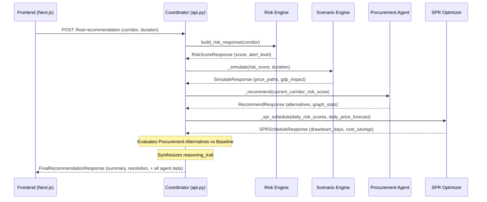

# Data Flow & Pipelines

This document traces the exact data flow through the Pravah backend during a `POST /final-recommendation` request. 

## End-to-End Orchestration Flow

## Detailed Data Transformations

### 1. External Data Ingestion
*   **Brent Crude History**: Used for scenario calibration. Checked upon server startup (`lifespan` event). If the EIA API is configured (`EIA_API_KEY`), it pulls live spot prices. Otherwise, it loads `_BRENT_CSV`.
*   **Geopolitical Events**: `_run_risk_pipeline` pulls hardcoded tuples from `_RISK_FIXTURES`. If `use_live=True`, it executes a REST call to `api.gdeltproject.org`. The raw JSON is normalized into `RiskKeyEvent` dictionaries.
*   **Market Forex**: `_recommend` attempts to call `exchangerate.host` to get live USD/INR conversions.

### 2. The Risk Multiplier
The most critical data flow in the application is how the `Risk Score` (a float between 0 and 100) cascades through the system:
*   In the **Scenario Engine**: `sigma = CALIBRATED_VOLATILITY + (0.05 * risk_factor)` (where `risk_factor = score / 100`). This literally widens the Monte Carlo simulation spread.
*   In the **Procurement Agent**: The `corridor_risk_score` is directly injected into the `norm()` scoring function. A high risk score heavily penalizes any route passing through that corridor, forcing the `nx.all_simple_paths` traversal to prefer mathematically longer but safer routes (like the Cape of Good Hope instead of the Red Sea).
*   In the **SPR Optimizer**: `value = price_forecast * (1.0 + (risk_score / 100.0))`. The knapsack algorithm aggressively prioritizes dumping reserves on days where the risk modifier multiplies the price pain.

### 3. Frontend Data Hydration
Because the `FinalRecommendationResponse` contains the full sub-responses from every agent, the frontend `dashboard.tsx` only needs to make a single API call to hydrate 80% of its UI. It passes `response.scenario.daily_price_path` directly into its Recharts line charts, and `response.procurement.recommendations` into its alternative tables.
