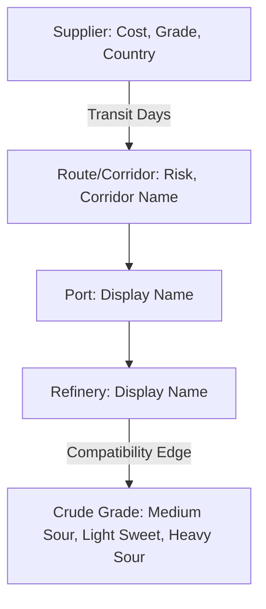

# Procurement Module Developer Walkthrough

This document provides a comprehensive technical walkthrough of the **Procurement Module** of the **Hormuz Resilience Platform (Pravah)**. It describes the technology stack, system architecture, core backend algorithms, frontend design, and step-by-step instructions for running, testing, and expanding the module.

---

## 1. Module Overview
The Procurement Module serves as an AI-assisted decision-making engine for Indian energy logistics. Its primary purpose is to:
* Recommend optimal alternative crude oil suppliers and transit routes for India during supply-chain disruptions.
* Balance tradeoffs between **Landed Cost**, **Geopolitical/Corridor Risk**, and **Transit Time** using user-defined weights.
* Trace and explain decisions transparently by showing reasoning paths on a visual supply network map.

---

## 2. Technology Stack

### Backend
* **FastAPI**: Lightweight, asynchronous web framework for building REST APIs.
* **NetworkX**: Python library for the creation, manipulation, and study of the structure, dynamics, and functions of complex networks.
* **httpx**: An asynchronous HTTP client used to query external spot oil price APIs and exchange rate tools.
* **Pydantic v2**: Data validation and settings management using Python type annotations.
* **Uvicorn**: An ASGI web server implementation for Python.

### Frontend
* **Next.js 15 + React 19 + TypeScript**: Modern framework stack for single-page dashboard execution.
* **Tailwind CSS 4**: Modern CSS utilities used for card styling and custom responsive grids.
* **React Simple Maps**: Declarative SVG world map component used for displaying routes, corridors, and node coordinates.
* **Lucide React**: Vector icons used throughout the weight configuration and metrics display.

---

## 3. Core Backend Architecture & Algorithms

The procurement service operates on a Directed Acyclic Graph (DAG) using NetworkX to find paths from suppliers to destination refineries.



### A. Knowledge Graph Definition (`graph_builder.py`)
The network is structured as a directed graph (`nx.DiGraph`) containing five node categories:
1. **Suppliers**: Node representing oil producers (e.g., `SAU_ARAMCO`, `RUS_ROSNEFT`) with base cost, grade class, and country attributes.
2. **Routes/Corridors**: Node representing sea lanes or land corridors (e.g., `hormuz_saudi`, `cape_russia`, `red_sea_suez`) with static baseline risk indexes (0-100).
3. **Ports**: Indian import destination terminals (e.g., `PORT_VADINAR`, `PORT_KANDLA`).
4. **Refineries**: Processing terminals (e.g., `REF_JAMNAGAR`, `REF_VADINAR`).
5. **Crude Grades**: Specific crude grade categories (`GRADE_MEDIUM_SOUR`, `GRADE_LIGHT_SWEET`, `GRADE_HEAVY_SOUR`).

Edges capture transit times (e.g., `transit_days` from Supplier to Route) and refinery processing capabilities (e.g., `compatibility` fraction on the Refinery to Grade edge).

### B. Normalization & Scoring Formula
Downstream recommendation scores are generated by compiling individual costs, transit times, and risk metrics into a unified **Composite Score** between `0.0` and `1.0`.

Because lower values of cost, transit time, and risk are preferred, individual metrics are normalized using an **inverted formula**:

$$\text{Normalized Value} = 1.0 - \left( \frac{\text{val} - \text{min}}{\text{max} - \text{min}} \right)$$

If the maximum and minimum values are identical, the metric defaults to `1.0`.

The final composite score is calculated using the normalized inputs and the weights supplied by the user:

$$\text{Composite Score} = (W_{\text{cost}} \times N_{\text{cost}}) + (W_{\text{risk}} \times N_{\text{risk}}) + (W_{\text{transit}} \times N_{\text{transit}})$$

### C. Deduplication Logic
A single supplier might reach the target refinery through multiple routes or ports. To prevent duplicate listings of the same supplier in the alternative recommendations list:
1. The solver finds all valid paths (`nx.all_simple_paths`) from each supplier to the target crude grade.
2. It filters out paths that do not pass through the requested refinery.
3. For each supplier, it selects the **shortest path** (the most direct route).
4. If multiple paths have equal length, it computes the composite score for each and retains only the single path with the highest score.

### D. Live Market Price Integration & Caching
The backend features an asynchronous pricing updater:
* **API Ingestion**: It calls `https://api.exchangerate.host/latest` to retrieve the current USD/INR exchange rate.
* **Pricing Caching**: Spot oil prices (Brent, WTI) are cached in-memory with a TTL (Time-To-Live) of 5 minutes (300 seconds).
* **Adjusted Landed Cost**: A per-supplier adjusted cost is calculated by blending static base prices (40%) with live spot prices and historical differentials (60%):
  $$\text{Landed Cost} = 0.4 \times \text{Base Cost} + 0.6 \times (\text{Brent} + \text{Supplier Differential})$$

---

## 4. API Specification

### `POST /recommend`
Computes alternative procurement plans based on current supply disruption weights.

#### Request Body
```json
{
  "current_supplier": "SAU_ARAMCO",
  "current_corridor_risk_score": 78.0,
  "target_refinery": "REF_JAMNAGAR",
  "required_crude_grade": "GRADE_MEDIUM_SOUR",
  "cost_weight": 0.5,
  "risk_weight": 0.3,
  "transit_time_weight": 0.2,
  "max_alternatives": 5
}
```

#### Response Body
```json
{
  "recommendations": [
    {
      "supplier": "RUS_ROSNEFT",
      "route": "cape_russia",
      "port": "PORT_MANGALORE",
      "grade_match": "GRADE_MEDIUM_SOUR",
      "grade_compatibility_score": 0.95,
      "estimated_cost_usd_per_bbl": 69.8,
      "transit_days": 42,
      "corridor_risk_score": 18.0,
      "composite_score": 0.742,
      "rank": 1,
      "reasoning": "Risk ↓60 pts via Cape of Good Hope (Russia). costs +$1.80/bbl. transit 42d (33d slower)."
    }
  ],
  "current_supplier_baseline": {
    "supplier": "SAU_ARAMCO",
    "estimated_cost_usd_per_bbl": 82.4,
    "transit_days": 9,
    "corridor_risk_score": 78.0,
    "composite_score": 0.325
  },
  "graph_stats": {
    "nodes_considered": 18,
    "edges_traversed": 12
  },
  "computed_at": "2026-07-11T17:11:19Z",
  "market_data": {
    "brent_usd": 84.12,
    "wti_usd": 80.55,
    "usd_inr": 83.42,
    "is_live": true,
    "fetched_at": "2026-07-11T17:11:19Z"
  }
}
```

---

## 5. Frontend Walkthrough & Interactive Map

The procurement dashboard layout is optimized for visual clarity, putting the map at the center and surrounding it with interactive control panels.

```
+--------------------------------------------------------------+
|                         Navigation                           |
+-------------+----------------------------------+-------------+
|             |                                  |             |
|   Weights   |            SVG Map               | Alternative |
|   Sliders   |                                  |   Cards     |
|             |  - Baseline (Dashed Line)        |             |
|   Market    |  - Recommended (Solid Blue Line) |   Baseline  |
|    Rates    |                                  |  Comparison |
|             |  +-----------------------------+ |    Card     |
|   Legend    |  | Impact HUD: Delta metrics   | |             |
|             |  +-----------------------------+ |             |
+-------------+----------------------------------+-------------+
```

### Key Interactive Features
1. **Dynamic Sliders**: Sliders on the left panel allow adjusting weights for Cost, Risk, and Transit Speed. Moving one slider automatically redistributes the remaining weight across the other two to ensure they always sum to 100%.
2. **SVG Map**: Renders country boundaries and dynamically overlays path segments:
   * **Dashed gray paths** represent the current baseline route (e.g. Saudi Arabia via Hormuz).
   * **Solid blue paths** show the route for the currently selected alternative from the right-hand panel.
3. **Alternative Cards**: Ranked by composite score. Click on any card to update the solid blue path on the map and display the respective metrics.
4. **Impact HUD**: Displays real-time delta indicators ($\Delta$ Cost, $\Delta$ Risk, $\Delta$ Transit Days) comparing the active alternative directly with the baseline.
5. **Market Status**: An status badge indicating if live spot market pricing feeds are currently online.

---

## 6. Setup & Execution Instructions

### Running the Backend Standalone
To run the procurement microservice on your local machine:

1. Navigate to the procurement agent directory:
   ```powershell
   cd procurement-agent
   ```
2. Install Python dependencies:
   ```powershell
   pip install -r requirements.txt
   ```
3. Run the FastAPI application using Uvicorn:
   ```powershell
   uvicorn main:app --reload --port 8000
   ```
4. Verify server availability by opening the Swagger docs:
   ```text
   http://127.0.0.1:8000/docs
   ```

### Running Backend Tests
Unit and integration tests verify the scoring normalization and route selection:
```powershell
pytest tests/
```

### Running the Frontend
1. Navigate to the frontend directory:
   ```powershell
   cd frontend
   ```
2. Install Node modules:
   ```bash
   npm install
   ```
3. Run the Next.js development server:
   ```bash
   npm run dev
   ```
4. Open your browser and navigate to `http://localhost:3000` (or the terminal-assigned port).

---

## 7. Code Extension & Customization Guide

### A. How to Add a New Supplier
To introduce a new supplier (e.g. Iraq or Venezuela) to the system, modify `procurement-agent/knowledge_graph/graph_builder.py`:

1. Define the supplier node inside `build_procurement_graph()`:
   ```python
   "VEN_PDVSA": {"type": "supplier", "cost": 72.0, "grade": "heavy_sour", "country": "Venezuela"}
   ```
2. Connect the supplier to a route using a directed edge, detailing the transit days:
   ```python
   G.add_edge("VEN_PDVSA", "cape_mexico", transit_days=28)
   ```
3. In `procurement-agent/main.py`, define the price basis differential relative to Brent inside `fetch_live_market_data()`:
   ```python
   "VEN_PDVSA_diff": -12.50
   ```

### B. How to Add a New Refinery
To register a new refinery node:
1. Add it to the `refineries` dict in `graph_builder.py`:
   ```python
   "REF_KOCHI": {"type": "refinery", "display": "Kochi Ref (BPCL)"}
   ```
2. Connect ports to feed this refinery:
   ```python
   G.add_edge("PORT_MANGALORE", "REF_KOCHI")
   ```
3. Establish grade compatibility margins:
   ```python
   G.add_edge("REF_KOCHI", "GRADE_MEDIUM_SOUR", compatibility=0.90)
   ```

### C. Adjusting Scoring Weights & Normalization
If you want to change how risk or transit time impact the recommendation, edit `composite()` function inside `procurement-agent/main.py`:
* For example, to switch from a linear normalization bounds mapping to a logarithmic scale (to penalize very high risks exponentially), modify the normalization helper:
  ```python
  def norm_exponential(val, lo, hi):
      # Custom non-linear normalization implementation
      ...
  ```

---

> [!NOTE]
> This guide is an internal asset and **will not** be pushed to GitHub to preserve repository cleanliness. Use this document as your local playbook when modifying the network topology or customizing the normalization criteria.
